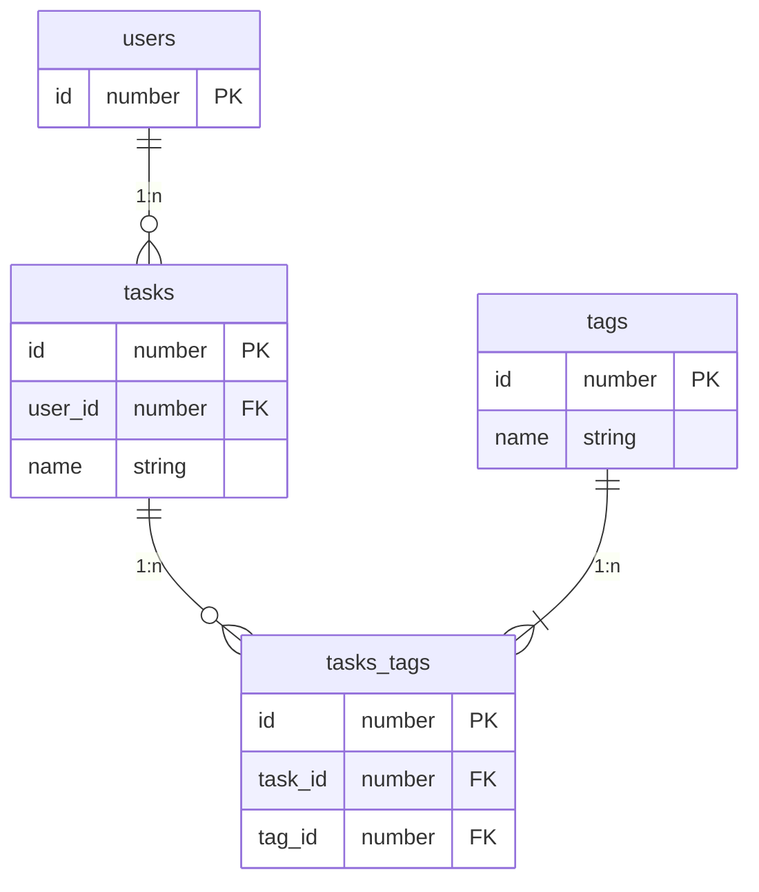

# TODO application using GraphQL and gRPC by Go

## ER diagram

## Links

- [gqlgen](https://gqlgen.com/)
- [ent](https://entgo.io/)
- [Atlas](https://atlasgo.io/)
- [golang-migrate](https://github.com/golang-migrate/migrate)
- [gRPC](https://grpc.io/)